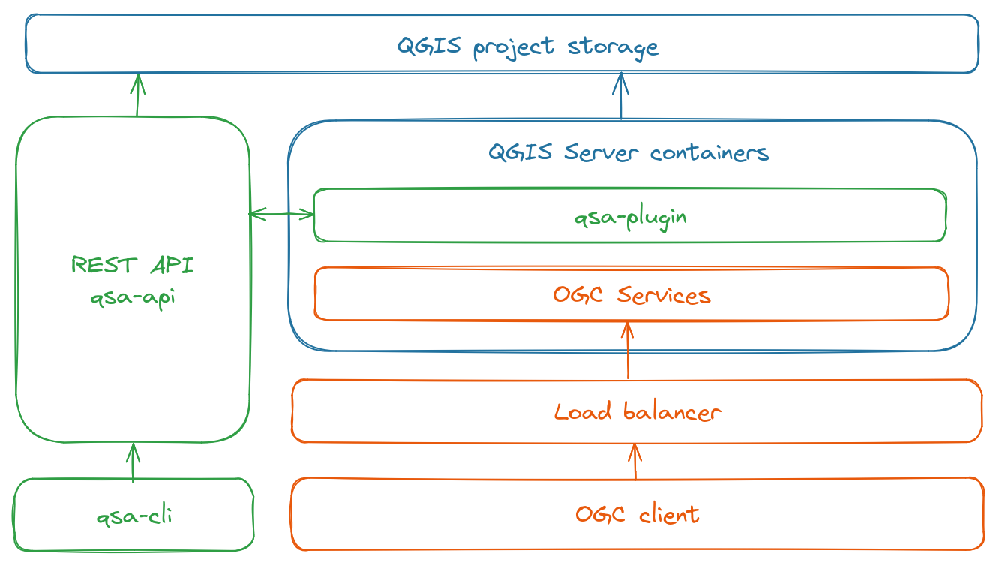

Welcome to QGIS Server Administration tool's documentation.

[QGIS Server](https://docs.qgis.org/3.34/en/docs/server_manual/introduction.html) is
a map-server based on the QGIS core library and rendering engine which provides
numerous classical services like WMS, WFS, WCS, WMTS and OGC API Features.
While QGIS Desktop acts like a WYSIWYG tool for setting up projects, the need
for a REST API is sometime necessary to configure and administrate QGIS Server: custom web client, cloud deployment, .... The aim of the QSA project is to
provide such an API and tools.

Components:

* [QSA REST API](qsa-api/): Flask web server with a REST API for administrating QGIS Server
* [QSA plugin](qsa-plugin/): QGIS Server plugin for introspection
* [QSA cli](qsa-cli/): Command line tool

Features:
* Create and manage QGIS projects stored on the filesystem or in PostgreSQL
* Create and update vector and raster layers : symbology, theme, ...
* Inspect online QGIS Server instances
* Optional cache management with MapProxy

Roadmap:
* Add more documentation
* Add PostgreSQL support to store QGIS styles and QSA internals data
* Publish `qsa-cli` on PyPI
* Publish a `qsa-api` Docker image on DockerHub
* Publish `qsa-plugin` on QGIS plugin repository
